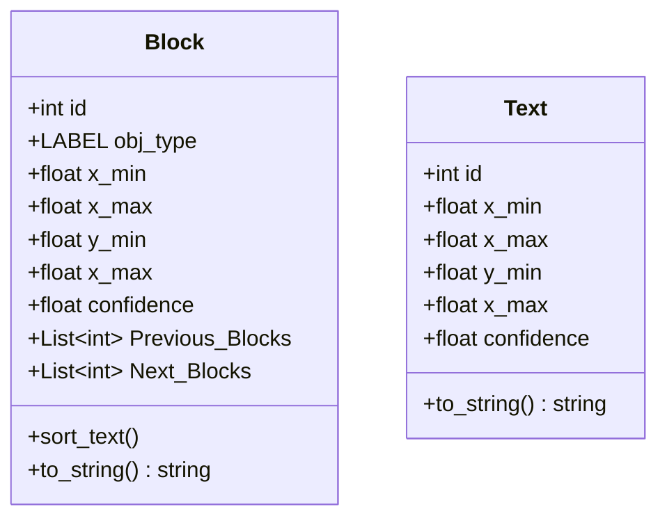

# Sidekick-S-api

## Objects detected by model

#### Original dataset
- Author: ISC UPIIZ students
- Title: Flowchart 3b
- Version: 3.0
- Date: May 2020.
- Editors: Onder F. Campos and David Betancourt.
- Publisher Location: Zacatecas, Mexico.
- Electronic Retrieval Location: https://www.kaggle.com/davbetm/flowchart-3b

#### Used dataset (added pointer detection)
- Electronic Retrieval Location: https://app.roboflow.com/yolo-umkl5/flowchart-etfvh/1

## Classes

## Operations in Process box
- Variables should be written with '_var' after name
  - Example: 
    - index_variable - Not valid
    - index_var - Valid
- Functions should be written with '_func' after name
  - Example:
    - function_name_func - Valid
    - function_name - Not valid
- Print:
  - Write some text inside
  - Write any variable without anything
  - Write any concatenation of text + variable + text
  - [ ] TODO: add images to show how to print
- Scan:
  - Write the variable where to save the data
  - [ ] TODO: add images to show how to print
- Process:
  - (Only in POO languages) Write a function to be called with '_func' after name
  - Write any math operation (+, -, *, /) between numbers and/or variables and store it under variable.
  - [ ] TODO: add images to show how to
- Decision:
  - Supports 2 options (if clause) or more (switch-case clause)
  - Supports while loop
  - Inside must be the clause
    - Examples:
      - test_variable_var > 5
        - option 1: True
        - option 2: False
      - test_variable_var
        - option 1: > 5
        - option 2: < 5
        - option 3: == 5
    - [ ] TODO: add images to show how to
    

## Limitations
- Maintain a good separation between arrows in arrow chains
- [ ] TODO: add images to show how to draw arrows
- All letters must be lowercase
- Letters in only one line
- Conditionals must stay in the nearest arrow to Decision block
- [ ] TODO: add images to show how to draw this conditionals
- Not allowed staked conditionals

## TODO-List
- Improve double pointer detection in arrow chains to avoid double detection in the same arrow
  - FlowchartObjectDetection._sort_arrows()
- Improve OCR detection
- String concatenation
- Do-While loop support
- For loop support