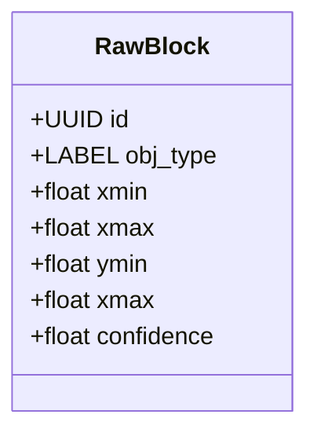

# Sidekick-S-api

```mermaid
classDiagram
    class RawBlock
    RawBlock: +UUID id
    RawBlock: +LABEL obj_type
    RawBlock: +float xmin
    RawBlock: +float xmax
    RawBlock: +float ymin
    RawBlock: +float xmax
    RawBlock: +float confidence
```