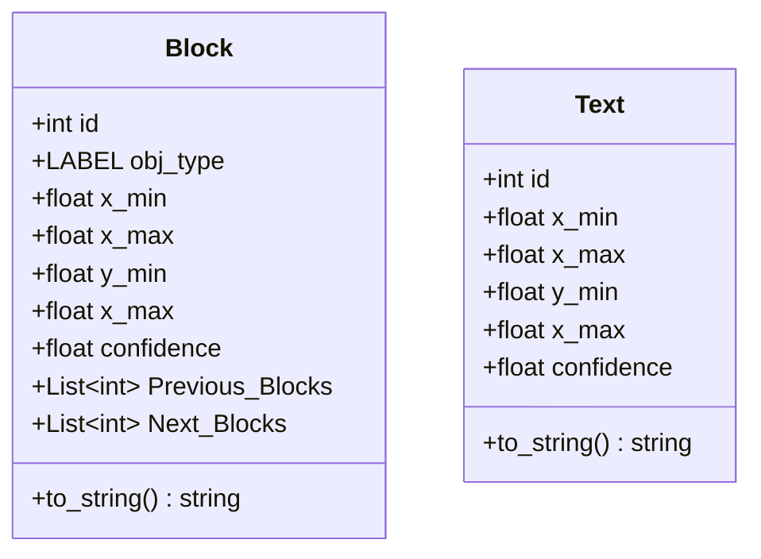

# Sidekick-S-api

## Objects detected by model

#### Original dataset
- Author: ISC UPIIZ students
- Title: Flowchart 3b
- Version: 3.0
- Date: May 2020.
- Editors: Onder F. Campos and David Betancourt.
- Publisher Location: Zacatecas, Mexico.
- Electronic Retrieval Location: https://www.kaggle.com/davbetm/flowchart-3b

#### Used dataset (added pointer detection)
- Electronic Retrieval Location: https://app.roboflow.com/yolo-umkl5/flowchart-etfvh/1

## Classes

## Limitations
- Maintain a good separation between arrows in arrow chains
- [ ] TODO: add images to show how to draw arrows
- All letters must be lowercase
- Letters in only one line

## TODO-List
- Improve double pointer detection in arrow chains to avoid double detection in the same arrow
  - FlowchartObjectDetection._sort_arrows()