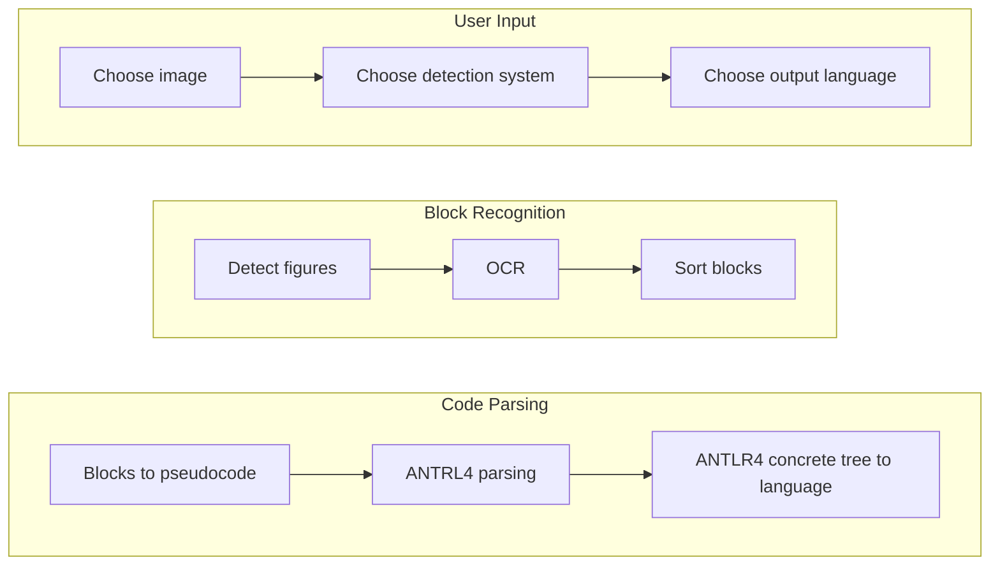

# Sidekick-S-api


## Classes


## General flowchart


## Blocks flowcharts


## Operations in Process box
- Print:
  - Write any variable without anything
- Scan:
  - Write the variable where to save the data
- Process:
  - Write any math operation (+, -, *, /, /=, *=, +=, -=) between numbers and/or variables
- Decision:
  - It's mandatory draw almost 2 options
  - Inside must be the clause
    - Examples:
      - If statement
        - Box clause: 
          - A <= 1
          - B == 1
          - A != 2
          - ...
        - Options
          - option 1: True
          - option 2: False
      - Switch statement:
        - Box clause: (You must set the variable)
          - VAR
        - Options
          - option 1: 5
          - option 2: 1
          - option 3: 10
          - option default: DEFAULT
    

## Limitations
- Maintain a good separation between arrows in arrow chains
- Letters in only one line
- Conditionals must stay in the nearest arrow to Decision block
- Conditionals statements must finalize on the same block
- Not nest conditionals
- Strings not supported

## TODO-List
- Improve double pointer detection in arrow chains to avoid double detection in the same arrow
  - FlowchartObjectDetection._sort_arrows()
- Improve OCR detection
- String usage
- Functions support
- While loop support
- Do-While loop support
- For loop support
- Switch-case support

## Examples
### Test 1 (TestIf)

**Abstract syntax tree**

**Python**
```
def main():
	VAR1: int = None
	VAR2: int = None
	VAR1 = 2
	VAR2 = input()
	VAR1 *= VAR2
	if VAR1 <= 10:
		VAR1 = 15 * VAR2
	else:
		VAR1 -= VAR2
		VAR1 = VAR1 + 5
		VAR2 = 10 / 5
	VAR1 = VAR1 + VAR2
	print(VAR1)
```
**Java**
```
import java.util.Scanner;

public static void main(String[] args) {
	Scanner scan = new Scanner(System.in);
	int VAR1 = null;
	int VAR2 = null;
	VAR1 = 2;
	VAR2 = scan.nextInt();
	VAR1 *= VAR2;
	if (VAR1 <= 10) {
		VAR1 = 15 * VAR2;
	} else {
		VAR1 -= VAR2;
		VAR1 = VAR1 + 5;
		VAR2 = 10 / 5;
	}
	VAR1 = VAR1 + VAR2;
	System.out.println(VAR1);
}
```

### Test 2 (TestSwitch)

**Abstract syntax tree**

**Python**
```
def main():
	VAR: int = None
	VAR = input()
	if VAR == 1:
		VAR -= 1
	elif VAR == 4:
		VAR += 7
		VAR /= 2
	else:
		VAR *= 10
	print(VAR)
```
**Java**
```
import java.util.Scanner;

public static void main(String[] args) {
	Scanner scan = new Scanner(System.in);
	int VAR = null;
	VAR = scan.nextInt();
	switch (VAR) {
		case 1:
			VAR -= 1;
			break;
		case 4:
			VAR += 7;
			VAR /= 2;
			break;
		default:
			VAR *= 10;
	}
	System.out.println(VAR);
}
```


## Objects detected by model

#### Original dataset
- Author: ISC UPIIZ students
- Title: Flowchart 3b
- Version: 3.0
- Date: May 2020.
- Editors: Onder F. Campos and David Betancourt.
- Publisher Location: Zacatecas, Mexico.
- Electronic Retrieval Location: https://www.kaggle.com/davbetm/flowchart-3b

#### Used dataset (added pointer detection)
- Electronic Retrieval Location: https://app.roboflow.com/yolo-umkl5/flowchart-etfvh/1