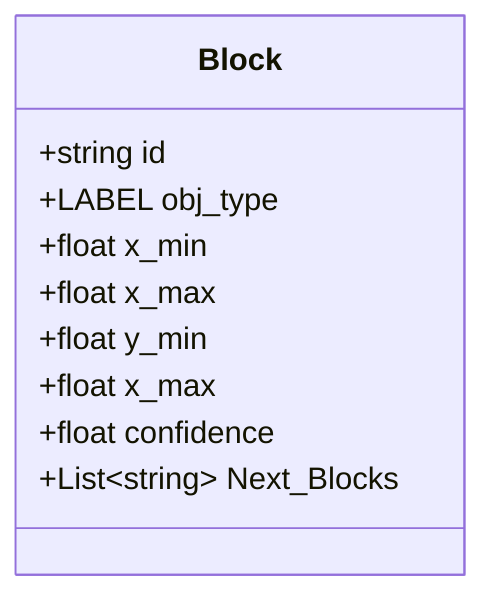

# Sidekick-S-api

```mermaid
classDiagram
    class Block
    Block: +string id
    Block: +LABEL obj_type
    Block: +float x_min
    Block: +float x_max
    Block: +float y_min
    Block: +float x_max
    Block: +float confidence
    Block: +List~string~ Next_Blocks
```